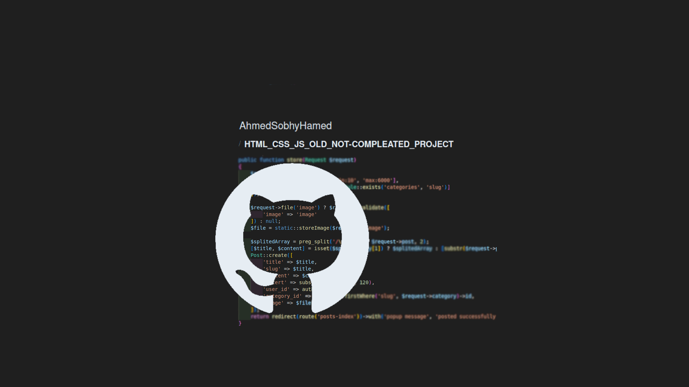

# HTML_CSS_JS_OLD_NOT-COMPLEATED_PROJECT

A small front-end project using HTML, CSS, and JavaScript to create a gallery website.


## Table of Contents

- [Introduction](#introduction)
- [Features](#features)
- [Installation](#installation)
- [Usage](#usage)
- [Technologies Used](#technologies-used)
- [Project Structure](#project-structure)
- [License](#license)
- [Contact](#contact)

  <!-- intro -->

## Introduction

This project is a gallery to share pictures with your friends on the site.
<br>
I decided to code this front-end project to practice while I was learning PHP. However, it was deprecated in the end, and I stored it for the future in case I decide to continue developing it. I organized it into separate pages and restructured the libraries for each page.

**this is a collection of a pages that was a part of a not compleated niglicted project.**

  <!-- technologies was used with links if available -->

## Features

- Create responsive web pages.
- Use pre-made custom CSS libraries.
- Create a drag and drop area to upload a file.
- Create a dropdown menu.
- Validate the file type.
- Validate the file size.

  <!-- get start and how to run with the prerequisites mintion -->

## Installation

1. Clone the repository:

```sh
git clone https://github.com/AhmedSobhyHamed/HTML_CSS_JS_OLD_NOT-COMPLEATED_PROJECT.git
```

2. open index.html file in your browser.

  <!-- usage or how to interact with this technologies like api end points and what they do -->

## Usage

**You can interact with the project via this link**
[web page on github](https://ahmedsobhyhamed.github.io/HTML_CSS_JS_OLD_NOT-COMPLEATED_PROJECT/).
<br>
In the
[adding image page](https://ahmedsobhyhamed.github.io/HTML_CSS_JS_OLD_NOT-COMPLEATED_PROJECT/addimg_form_HTML-CSS-JS/addimg.html)
You can drag and drop a file in the designated area or simply click on it to open the file browser widget.

## Technologies Used

- HTML 5.
- Pure CSS.
- Use font awesome CSS library.
- Vanilla JS.

Example:

  <!-- about the project and a digram of how it work -->

## Project Structure

- CSS libraries:
  - projectPage_folder/css/container.css
  - projectPage_folder/css/list.css
  - projectPage_folder/css/grid.css
- CSS general rules:
  - projectPage_folder/css/generalroles.css
- CSS custom style:
  - projectPage_folder/css/style.css
- js files:
  - addimg_form_HTML-CSS-JS/js/script.js
- HTML files:
  - projectPage_folder/\*.html
- redirect file:
  - index.html
  (to start the separate pages as a single one as before arranged).
    <!-- licance -->

## License

This project is licensed under the MIT License - see the [LICENSE](/LICENSE) file for details

  <!-- contacts -->

## Contact

Created by [Ahmed Sobhy]:

- email: [ahmed.s.abdulaal@gmail.com](mailto:ahmed.s.abdulaal@gmail.com)
- linkedin: [Ahmed Sobhy](https://www.linkedin.com/in/ahmed-sobhy-b824b7201/)
  <br>
  feel free to contact me!
